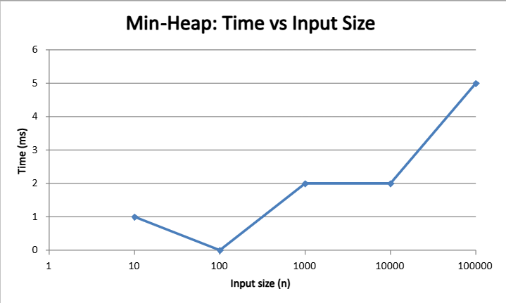
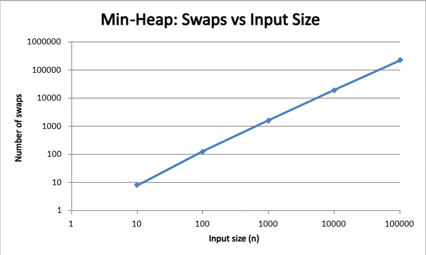

# DAA Assignment 2 — Min-Heap Implementation

Name: Sakenov Rassul
Group: SE-2435

## Overview
This repository contains an implementation of a **Min-Heap** data structure in Java,  
developed for the *Empirical Validation and Optimization* assignment (DAA).  
The heap supports core operations such as **add**, **poll**, **peek**,  
as well as extended operations: **decreaseKey**, **merge**, and **fromArray (Floyd’s Build)**.

---

## Features
- Efficient bottom-up heap construction (Floyd’s algorithm, Θ(n))
- Supports `add`, `poll`, `peek`, `decreaseKey`, `merge`
- Fully instrumented with performance metrics:
    - `comparisons`, `swaps`, `reads`, `writes`, `heapifyCalls`
- CI pipeline (GitHub Actions) — automated tests and build verification
- Benchmark runner with CSV export and performance plots

---

## Theoretical Complexity

| Operation        | Time        | Space        | Notes                  |
|------------------|-------------|--------------|------------------------|
| add / poll       | O(log n)    | O(n)         | Heapify per insertion  |
| peek             | O(1)        | O(1)         | Access top element     |
| fromArray (Floyd)| Θ(n)        | O(n)         | Bottom-up build        |
| merge            | Θ(n + m)    | O(n + m)     | Rebuild after merging  |
| decreaseKey      | O(log n)    | O(1)         | Percolate up           |

## Performance Plots

Below are the results from the empirical benchmark of the Min-Heap algorithm.

### Figure 1 — Time vs Input Size

This plot shows how execution time increases as input size grows.
The trend matches the expected O(n log n) complexity.

### Figure 2 — Swaps vs Input Size

This plot illustrates the number of element swaps, 
which also follows an O(n log n) trend.

## Peer Review Report

The detailed peer review for the partner's(Aitkalis) 
Max-Heap implementation is available here:

[MaxHeap_Peer_Review_Report.pdf](docs/performance-plots/MaxHeap_Peer_Review_Report.pdf)

